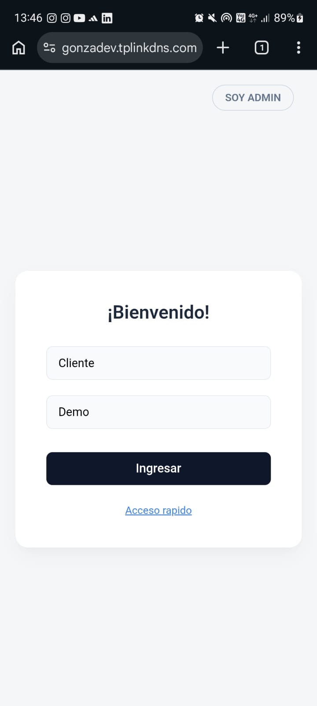
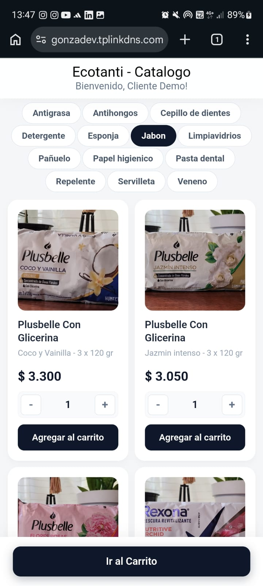
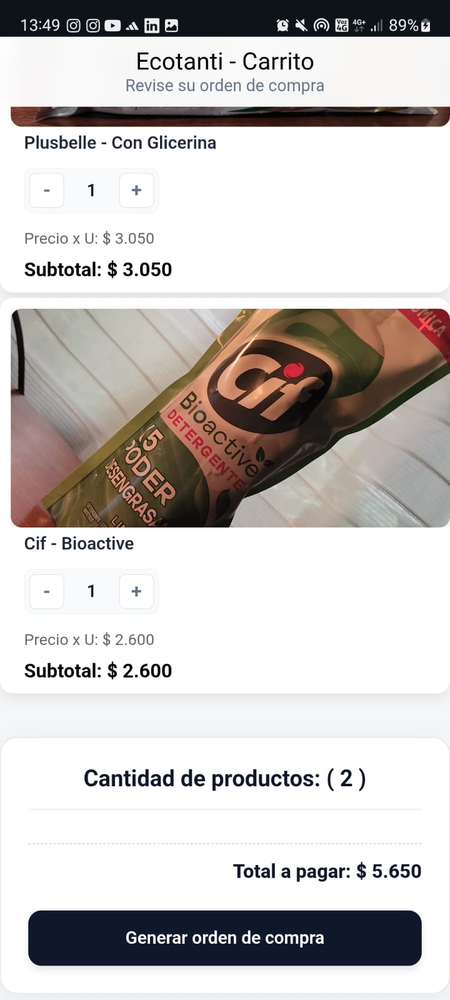
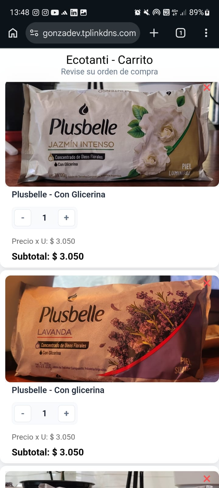
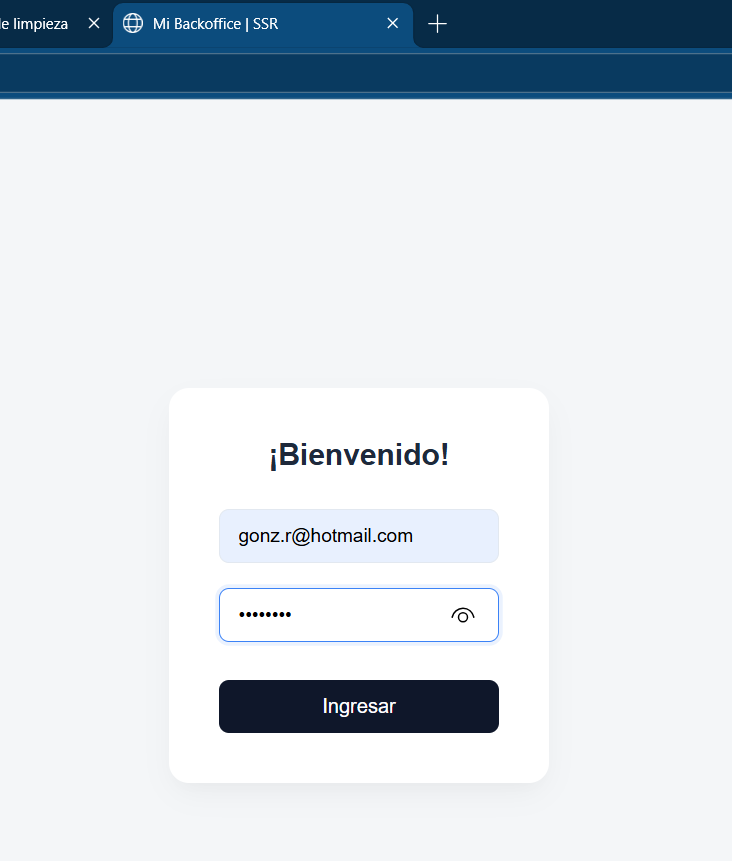
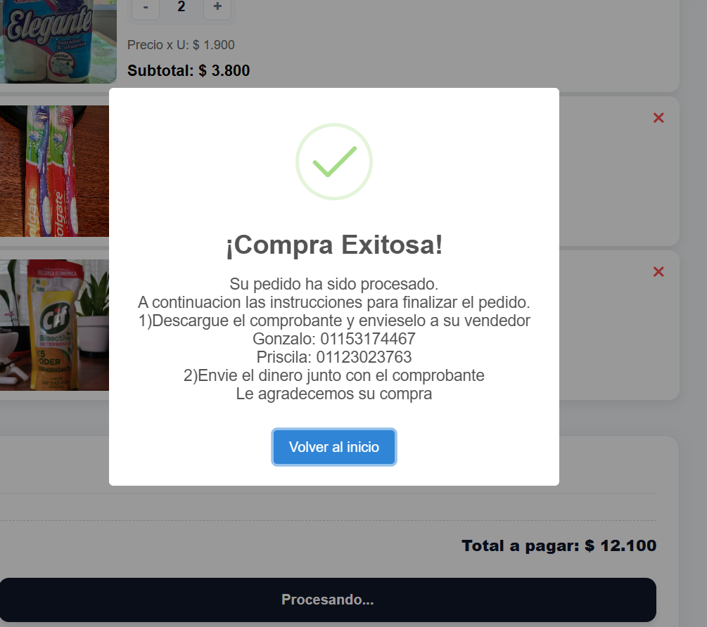
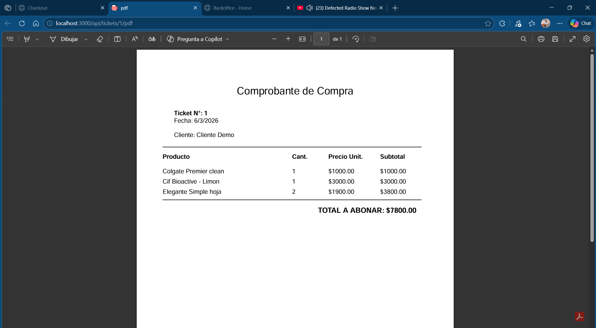
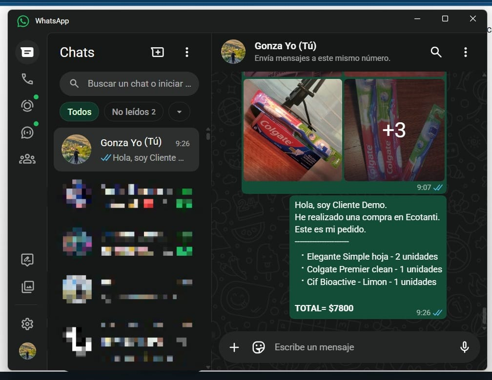

# Tienda
Pueden visitar la pagina siguiendo el enlace:
https://gonzadev.tplinkdns.com/ecotanti

## 🎯 Objetivo
Este es un proyecto que funciona como una tienda personal que permite al administrador y usuario las siguientes acciones:
- ABM de marcas de productos.
- ABM de productos.
- Manejar stock en tiempo real.
- Usuarios podran hacer compras de los productos que haya en stock
- El administrador podra modificar el estado de los pedidos (pendiente, finalizado, cancelado etc)
- Si un pedido se cancela, los productos que componen el pedido vuelven al inventario
- Conexion con Whatsapp entre cliente y administrador.

## 📌 Requsitos
- Funcionales
    - ABM de marcas
    - ABM de productos
    - Manejo de stock
    - Integracion con Whatsapp
- No funcionales
    - Innterfaz limpia, clara y despejada de elementos innecesarios que interrumpan el proceso de compra

## 🧱 Stack Tecnologico
- Node JS
- Express
- JWT
- MySQL
- ORM (Sequelize)
- EJS --> SSR
- API Rest

## 🏃‍♂️‍➡️ Como ejecuto el proyecto?
- Setear variables de entorno.
- En la carpeta back ejecutar npm install
- Una vez instalados los paquetes correr el proyecto con npm run dev

## 📂 Estructura del proyecto
- Back: carpeta contenedora de los archivos pertinentes al backend de la app.
    - Docs: documentacion importante del proyecto (estado, futuras implementaciones, diario de desarrollo, etc)
- Front: Carpeta contenedora de los archivos pertinentes al frontend de la app

## ☑️ Estado 
- [✅] Registro de usuarios
- [✅] Login de usuarios
- [✅] SSR
- [✅] Registro de Admin
- [✅] Login con autenticacion para Admin
- [✅] Backoffice
- [✅] UI para ABM de Marcas
- [✅] UI para ABM de productos
- [✅] UI para visualizacion de pedidos

## 📷 Capturas en dispositivos moviles

  

  

  

  

## 📷 Capturas en PC

  

  

  

  

  

  

